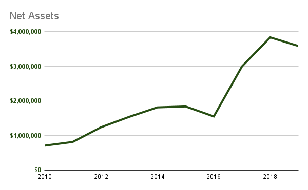

layout: true
name: fullheader
background-image: url(img/neonbrand-258972-unsplash-sm.jpg)
background-size: cover

---
layout: true
name: contributions
background-image: url(img/rawpixel-600782-unsplash-sm.jpg)
background-size: cover

---
layout: true
name: thanks
background-image: url(../client/img/stuart-guest-smith-150560-169.jpg)
background-size: cover

---
layout: true
name: logorb
class: left
background-image: url(img/apachecon2021.png)
background-repeat: no-repeat
background-position: 98% bottom
background-size: 20%
background-origin: padding-box

---
template: fullheader
# Coming Up Next

.left-column[
]
.right-column[
## Who Pays For FOSS Foundations?
**[@ShaneCurcuru](https://twitter.com/shanecurcuru)**
]

.footnote-right[Tip: Press '?' for help]

---
template: fullheader
# Who Pays For FOSS Foundations?
## The Funding Behind Open Source Organizations

.left-column-equal[
**[@ShaneCurcuru](https://twitter.com/shanecurcuru)**
]

.right-column-equal[
_Punderthings Consulting LLC_
]

---
template: logorb
# Who pays for open source Foundations?

What does that actually mean? 
- What is **open source**?
- **How do you pay** for it?
- What **things or activities** are paid for?
- How do **Foundations** get funded?

???
Talking with 5 people about "FOSS Funding" gives you 10 different topics to cover, so let's define what we're covering here today.  I may not have all the answers for you, but I want to give everyone a framework of all the different aspects of how to think about the funding behind open source.

First, we'll consider the **different ways to contribute** to open source - code, services, activities, events, sponsorships.

Then we'll talk money - how key FOSS Foundations get funded - and how much.

I expect many of you will end up with more questions to ask after this talk - there are many other areas of "funding" to cover out there, and I'm hoping this overview will make you think a little more about how open source works at scale, especially with larger projects or the many foundations that provide a home to so many important projects out there.

---
template: logorb
# What does *Open Source* mean?

Publicly available source code offered under an Open Source Initiative listed license. 

.code[https://opensource.org/osd-annotated]

???
Let's start with the simplest part first.  Open Source is released under an OSD-compatible license, and is available for free under the license.

What's really important is: who's behind that project?  Who is the active community, and how do they manage the project?  What kind of governance does the community have for that project?  How do they get other support, for awareness, events, outreach, or infrastructure?

---
template: logorb
# _Who_ are we talking about?

- Contributing work
  - Users
  - Contributors
  - Committers / Maintainers
- Contributing work or funding
  - **Commercial companies**
  - Governments
  - Research / Academic institutions

???
The who includes **all** of us involved in building, testing, documenting, marketing, selling, and whatever-ing open source - along with the actual code committers.  On the whole, individuals are contributing in any way you can imagine.  And while we don't often think of individual effot as being funded, that changes when you ask yourself: how **valuable** is your **own** time that you spend here?

What most people are curious about is: how much of the work of building and maintaining open source projects is done by individuals, in their free time or as hobbyists?  Versus how much work is funded directly by companies, governments, or academia - either by hiring engineers to work on projects, or by funding FOSS events, services, or other activities?

The ratios of who does what varies widely depending on the project or industry - but there are clear trends in major projects.

---
template: logorb
# How do we 'pay' for open source?

.left-column-equal[
**Effort**
- Pull requests
- Submitting bugs
- Fixing bugs
- Providing support
- Donating new projects
]

.right-column-equal[
**Funding**
- Sponsoring
- Events
- Services
- Hosting / Clouds
- Paying employees
]

???
Hopefully we all realize that the 'paying' part - as in money - is only a small part of how open source software actually gets created and **maintained**.  Sure, there are plenty of examples of companies or grant funders providing cash sponsorships for major projects, or running events or providing CI and cloud services to open source projects.

But the more important impact **from the project perspective** are the actual contributions of **work**.  All the code submitted, all the bugs reported - or bugs fixed!  All the help and support offered to other users - who then become contributors in the ecosystem.  While all these contributions aren't necessarily a result of cash payment somewhere, they are certainly related the key way that individual projects grow: by growing their code and community.  The fact that individuals may contribute **as part of their paid dayjob** often obscures which work is "paid" or not.

I have a theory about how much of this work is from individuals versus companies.

---
template: contributions
# Most major open source is from companies

???
Here's my belief: most of the major open source projects used today are now primarily built and maintained by companies directly paying their employees to contribute.  Let's see what data from some major projects show.

---
template: logorb
# Direct or indirect contributions?

- Direct contributions
  - Code, cloud credits, services
  - Committed by corporate employees or individuals

- Indirect contributions
  - Company hiring consultant to contribute all of the above 

- Funding
  - Sponsoring Foundation or project directly

???
Let's review how organizations usually contribute to projects.

- Committing code (docs, tests, community support, etc) 
  - When you contribute work as an individual, it's often opaque to the community if you're doing this in "free time", or if you're doing this as paid work
- Hiring someone to do the above work
- Or: directly funding FOSS Foundations or projects with cash or sponsorships.

---
template: logorb
# Linux kernel development

The Linux Kernel Report tracks which companies are sponsoring work.

???
The Linux Kernel Report does a thorough analysis of both who's contributing all the code, as well as who they're working for or being paid by.

_SPACEBAR_

--
- In 2018, **85%** of all code was *paid corporate work*

--
-  2016 it was 80%
-  2015 it was 80%
-  2013 it was 80%
-  2012 it was 75%
-  2010 it was 70%

???
The great majority of work done in the Linux kernel is done directly by corporations (having their employees make the fixes), and this number is only going up over time.  For example, the 2020 Kernel Report (which uses a different reporting format) shows only 11.95% of commits from developers "known to be working on their own time".

---
template: logorb
# Apache software committers

Survey: how Apache committers contribute to their projects.

- ~**50%** replied it was as an *Employee (as their job)*
- ~40% replied as an *Individual (outside regular job)*
- ~10% were *Retired, students, other*

.code[https://s.apache.org/2016dsurvey]

???
Let's look at the ASF - which has over 200 Apache project communities.  In 2016 we ran a survey.

The ASF ran a similar survey last year, which also shows a high percentage of work on our projects is directly paid.

---
template: logorb
# Drupal commits and sponsors

Drupal regularly updates their contribution reports - in 2020:

- **69%** of code was *Wholly sponsored work*
- 16% was *Work that's a mix or not credited*
- 15% was *Purely volunteer work*

.code[https://dri.es/who-sponsors-drupal-development-2020]

???
Drupals' credit system uses commit logs to show not just who wrote the code, but if the contributor was sponsored or paid to do make that commit by a company or other entity.  That counts either software vendor employees, or consultants or integrators working for end users.

The ratio of sponsored to not sponsored is increasing over time, and my bet is a similar ratio is in most of the widely-used software products in business today.

---
template: logorb
# Where do projects come from?

Where did today's widely-used open source projects get started?

- Passionate hobbyists?
- Academic or research projects?
- Vendor groups collaborating together?
- Single company projects being donated?

???
How do projects start being open sourced?  The answer is: all of these places

While plenty of FOSS projects you may use came from individual developers, many of the key bits of technology used in business today came from... business.

_SPACEBAR_

This is where opens source foundations like Apache, Eclipse, and Linux Foundation come in: they all have incubation processes to help new projects get started as true open source or open governance projects.

--
- **All of the above**

_But mostly: companies_

???
While the long tail of lone developer open source projects may be interesting technically, when we consider open source that makes an impact - is broadly used - we find most come from either corporate spinoff projects, or individual projects that gained **significant** corporate contributions and leadership early.

---
template: contributions
# Most major open source is from companies

???
So, what do you think of my thesis now?

At least half of contributions to major projects are effectively funded, by companies paying their staff, or by integrators or agencies doing paid work for clients.

---
template: logorb
# Role of FOSS Foundations

Foundations can be an independent home for open source projects.

Why is this important?

What services do Foundations provide?

???

For small projects, this is a regular struggle - keeping a project alive over time, ensuring fixes are made, drawing in new contributors, or keeping the CI/CD pipelines running..

Thus, we have FOSS foundations, like Apache, Linux, Eclipse, Software Freedom Conservancy, and now many others.  
These foundations can scale up all the non-software engineering a larger project needs - like fundraising, legal, infrastructure, governance and mentoring support. 

---
template: logorb
# Services Foundations provide

Foundations provide:
- Governance
- Mentoring
- Legal shield
- Fundraising
- Hosting, build pipelines, clouds
- Respectability / brand management
- Events
- Community education / management
- Marketing / ecosystem development

???
We still rely on many volunteers to help, but when it comes to reviewing contracts or doing the accounting on donations, we need hired help.  Accounting volunteers are rare to find in the coding world, and few coders want to carry a beeper for 24x7 support when the server goes down.  All these services we need money for.

All of these services are hard to provide at scale with volunteers - so Foundations are needed to provide the fiscal organization to pay someone to provide them.

---
template: fullheader
# Foundation Services, Sponsors, And Funding

???
Non-profit foundations attract some donations - from individuals or small businesses who want to say thanks for the software we provide.  But the bulk of funding for most software non-profits comes from corporate grants or recurring sponsors.

How do these foundations get their money?  Primarily recurring corporate sponsorships.

Let's review four key FOSS Foundations, and how they're funded.

---
template: logorb
# Software Freedom Conservancy

.left-column-equal[
**Project Overview**
- 46 projects
- Independent governance
- Independent branding
- **501C3** Public Charity
]

.right-column-equal[
**Scalable Services**
- Legal
- IP stewardship
- Financial
- GPL compliance
]

???
Conservancy offers basic fiscal sponsorship services, along with some legal and IP support.  Additional services may be available resources permitting when projects make requests.

---
template: logorb
# Conservancy - Sponsors

- Amateur Radio Digital Communications
- Code Weavers
- Google
- Indeed
- JMP
- Mark Wielaard
- Mozilla
- Red Hat

.footnote[Conservancy is a **501C3** Public Charity]

???
Conservancy lists their major sponsors, along with a number of smaller, individual sponsors.  Conservancy doesn't list sponsorship amounts, but my bet is that the above sponsors provide the bulk of Conservancy's annual income.

---
template: logorb
# Conservancy - Funding

.left-column-equal[

]

.right-column-equal[

]

???
On the left, we see Conservancy's annual gross income for the past few years, primarily from donations.  Their income varies, but a rough average for this period is a bit less than $2million annually.

On the right, we can see Conservancy's Net Assets - cash in the bank or investments for their continuing operations.

---
template: logorb
# Apache Software Foundation

.left-column-equal[
**Project Overview**
- 200+ projects
- Apache Way governance
- Apache *Project* branding
- **501C3** Public Charity
]

.right-column-equal[
**Scalable Services**
- Legal
- IP stewardship
- Infrastructure
- Conferences
- Community mentoring
- Lifecycle support
]

???
The ASF hosts well over 200 Apache project communities.  While each project is managed independently, the board provides oversight to ensure they are following the Apache Way.  The ASF also provides hosting and infra, and especailly community mentorship, as well as lifecycle support in the Apache Incubator and Apache Attic.

---
template: logorb
# Apache - Sponsors

Apache's nine Platinum sponsors are:

.left-column-equal[
- yahoo!
- Amazon Web Services
- Tencent Cloud
- Pineapple Fund
- Huawei
]

.right-column-equal[
- Namebase
- Facebook
- Google
- Microsoft
]

.footnote[The ASF is a **501C3** Public Charity]

???
Those are just the platinum sponsors, but they represent over $1M in annual donations, or about half the financial income for the entire ASF.  These sponsors get a thank you and a listing on our webpage, but otherwise have no influence over how the ASF or Apache projects are run.

Thank you to all the ASF sponsors, Gold, Silver, Bronze, and in-kind sponsors too as well as all our ApacheCon event sponsors!

---
template: logorb
#  Apache - In-Kind Sponsors

Apache's Targeted _(In-Kind/Services)_ Platinum sponsors are:

.left-column-equal[
- DLAPiper
- JFrog
- Verizon Media
- Microsoft
- Sonatype Nexus
]

.right-column-equal[
- OSU Open Source Lab
- CloudBees
- Amazon Web Services
- JetBrains
- Leaseweb
]

???
There are more ways to organizationally support Apache than just donating cash.  Each of these organizations is a Targeted Platinum sponsor, meaning they donate the equivalent of a Platinum sponsorship of hosting services, bandwidth, cloud credits, and CI pipelines or testing resources to Apache projects.

Importantly, these are all services that Apache projects directly need and are actually using.

---
template: logorb
# Apache - Funding

.left-column-equal[

]

.right-column-equal[

]

???
Here we can see the ASF's income and assets - an average of about $1million annual income, with the singular blip of the Pineapple fund one-time donation in 2017.  More projects and more services that Conservancy, but slightly smaller funding numbers.

Note that all numbers here are taken directly from the 990 tax forms that all US charities file with the IRS.

---
template: logorb
# Eclipse Foundation

.left-column-equal[
**Project Overview**
- 350+ projects
- Independent governance
- Various branding
- Shared releases
- **501C6** Business League
]

.right-column-equal[
**Scalable Services**
- Legal
- IP stewardship
- Infrastructure
- Development process support
- Ecosystem development
]

???
Eclipse's model is partly focused on their IDE and developer tools, so along with the usual services, they provide strong development process and integration support.  Many projects also follow a shared release schedule, as their projects work together.

---
template: logorb
# Eclipse - Sponsors

.left-column-equal-sm[
- CEA List 
- Daimler TSS
- DLR
- Fraunhofer FOKUS
- Fujitsu
- Huawei
- IBM
]

.right-column-equal-sm[
- IOTA Foundation
- Microsoft
- OBEO
- Oracle
- Red Hat
- Bosch
- SAP
- Skymind
]

.footnote[Eclipse is Belgian non-profit, with a 501C6 Business League in the US]

???
Eclipse has a mixed model, where there are corporate sponsors just contributing cash, but far more strategic members who contribute both funds as well as designated contributions and employee work.  

Those Strategic Members donate about **3M to Eclipse annually**, which again is roughly half of their total financial income.

Note that Eclipse recently reorganized to be a multinational non-profit.  Their website states:

The Eclipse Foundation is now comprised of four organizations:

- Eclipse Foundation AISBL is an international not-for-profit association based in Brussels
- Eclipse.org Foundation, Inc. is incorporated in the State of Delaware, USA as a 501(c)6 not-for-profit
- Eclipse Foundation Canada is a Canadian nonprofit member-based organization incorporated under the laws of Canada
- Eclipse Foundation Europe GmbH is a wholly-owned Germany subsidiary.

---
template: logorb
# Eclipse - Funding

.left-column-equal[

]

.right-column-equal[

]

???
Here we can see the Eclipse's income and assets - averaging over $4million in annual income.  More projects and more services, but notably higher funding. Eclipse's leading sponsorships are tied to part of their corporate governance structure, and thus are both a larger and more stable source of sponsorship income than Conservancy or Apache have.

---
template: logorb
# The Linux Foundation

.left-column-equal[
**Project Overview**
- 150+ projects
- Industry/Community mixed governance
- Independent branding
- **501C6** Business League
]

.right-column-equal[
**Scalable Services**
- Legal / IP stewardship
- Infrastructure
- Development process support
- Community management
- Ecosystem development
- Marketing
- Conferences
]

???
The Linux Foundation has a large number projects, several of them giant factors in today's software world.  They also operate with an agency model, where Linux Foundation employees provide a wide variety of services to projects - some employees are directly assigned to specific projects.

---
template: logorb
# The Linux Foundation - Sponsors

That's a complicated question.

Many Linux Foundation projects have their **own funding models**.

???

---
template: logorb
# The Linux Foundation - Sponsors

The fifteen Platinum Corporate Members of the Linux Foundation:

.left-column-equal-sm[
- AT&T
- Ericsson
- Facebook Open Source
- Fujitsu
- Hitachi
- Huawei
- Intel
- Microsoft
]
.right-column-equal-sm[
- NEC
- Oracle
- Qualcomm
- Red Hat
- Samsung
- Tencent
- VMWare
]

???
Each platinum member/sponsor of the Linux Foundation as a whole reportedly pays about 500K annually, and provides representatives both on the board of the foundation as well as in various technical bodies of collaborative projects.

This list represents **over 7M of annual income** for the Linux Foundation.

---
template: logorb
# CNCF - Sponsors

The twenty-three Platinum member sponsors of the CNCF are:

.left-column-equal-sm[
- Alibaba Cloud
- AWS
- Apple
- ARM Holdings
- AT&T
- Cisco
- Fujitsu
- Google Cloud
- Grafana Labs
- Huawei
- IBM Cloud
- Intel
]
.right-column-equal-sm[
- JD.Com
- Kasten by Veeam
- Microsoft Azure
- Net App
- New Relic
- Oracle
- Prisma Cloud
- Red Hat
- SAP
- VMWare
- VolcanoEngine
]

???

The Cloud Native Computing Foundation is a subsidiary of the Linux Foundation, and just for the CNCF, they have this list of platinum sponsors, each of which are donating in the range of 250K or more annually to the CNCF.

These are just sponsoring the CNCF, and likely represents at least **4M in annual income**, if not notably more, for the CNCF and Linux Foundation.

---
template: logorb
# Hyperledger - Sponsors

The thirteen Premiere Members of Hyperledger Foundation are:

.left-column-equal[
- Accenture
- Consensys
- DTCC
- Fujitsu
]
.right-column-equal[
- Hitachi
- IBM
- JP Morgan
]

???
Each of these premier members for Hyperledger likely provides an approximate 250K annual donation, as well as employees working on it.  While this may not seem like many, Hyperledger also has 116 other corporate supporting members, also chipping in around $50K, along with LF dues.

This list represents nearly **2M in annual income** for Hyperledger and the LF.

---
template: logorb
# OpenJS / Node.js - Sponsors

The four Platinum Members of OpenJS Foundation are:

- Google
- IBM
- Joyent
- Microsoft

???
The OpenJS foundation now hosts a number of key JavaScript projects, like Node.js, jQuery, webpack, Dojo and Electron.

The platinum sponsors listed here contribute **1M in annual income** to OpenJS and the LF.

---
template: logorb
# Who Sponsors The Linux Foundation?

... and the 100's of Collaborative Projects at the LF?

**Answer:** A lot of companies, many repeatedly.

???
There are probably a dozen **major** collaborative projects, each with their own sponsors (and products), and another hundred plus or so smaller projects - still interesting, but with fewer or little direct funding.

In particular, you'll note there are many software vendors - and non-software companies! - who are sponsoring multiple projects at the LF with cash as well as contributions.

---
template: logorb
# The Linux Foundation - Funding

.left-column-equal[

]

.right-column-equal[

]

???
Here we can see the LF's income and assets.  Huh.  Those are pretty big numbers - these charts are an order of magnitude higher than the earlier charts.  In 2019, LF made an estimated $124 million in income, and listed net assets of $58 million.

Anyone surprised at these numbers?  Remember: these figures are from 2019 and are estimated, since their IRS 990 tax form isn't yet published.  As a Business League, the LF doesn't otherwise provide public budget figures, so we don't know what their 2020 income was, or what the blip in their net assets over 2017 was.

---
template: logorb
# Governance, Funding, And Community All Matter

Community and governance matters too, beyond funding or license.

???
Wow - I bet those funding numbers are giving you something to think about going forward, huh?  These four foundations - along with several others - provide valuable fiscal and community hosting to a large percentage of interesting open source projects in the world today.  And remember: actual contributions and community governance are often more important long-term than just cash funding.

When you bring a new project to the ASF or to another foundation, you're making a fundamental choice about more than the license.  You're setting the stage for how the project is going to grow, who's going to want to contribute to it, and where it's long-term direction can end up.  Funding and governance are more important than the license choice.

In particular, funding is not required to get FOSS Foundation services - but in some cases, more funding does get you more concentrated help from open source experts.  The large cash differences in the charts earlier are definitely related to the amount of services different foundations can directly provide to their flagship projects.

---
template: thanks
name: closingslide
class: inverse-header
# Who Pays For Open Source?

# The Data Is Out There

Do your own research

.code[https://projects.propublica.org/nonprofits/] 

_NEW_ FOSS Funding research pointers

.code[https://fossfunding.com/] 

Guide to help you chose a foundation

.code[http://chooseafoundation.com/] 

---
name: last-page
template: thanks

## Thank You &amp; Questions!

## [@ShaneCurcuru](https://twitter.com/shanecurcuru)
.code[http://shaneslides.com]

<a rel="license" class="code" href="https://www.apache.org/licenses/LICENSE-2.0.html">Apache v2.0</a>

---
template: logorb
# Other topics to investigate

- RedisLabs and the Commons Clause
  - Source-Available or Cloud Licenses
  - Audacity and MuseScore
- Open Source Sustainability
  - How do **I** get paid for open source?
  - Project sustainability from a **community** point of view
- New work funding models
  - Patreon and crowdfunding
  - Bountysource pays for specific work
  - Tidelift, Liberapay, Open Collective and subscriptions
  - Building your own business model
- Open Usage Commons and trademark management

???
There's a lot more to talk about out there - I look forward to your ideas!

---
template: logorb
# What Ways Do Companies Contribute?

- Obvious: employees contributing code
- Obvious: sponsoring events
- Not obvious: infrastructure, tooling

There's a lot of talk about how much - or how little - money various companies and vendors pay into the open source arena.  But the discussions about money are missing a huge factor: what are all the **different ways** that Companies contribute work back to FOSS projects?

It's often not obvious to quantify some of the supporting ways that companies contribute, but they're certainly there.  Managing a full open source project needs source control, web space, continuous integration and testing, and often requires access to cloud services.  Either directly or indirectly many software vendors like github, amazon, google and more all effectively donate these kinds of services to projects.  Sometimes it's explicit and called out, often it's simply free accounts for any open source contributor

But the real value is in how much corporate employees contribute work to FOSS projects - code, documentation, tests, and more.  

While many individual developers may feel unappreciated for their volunteer work, that's only a small part of the overall patches and code that is put into open source projects.  It depends on the kind and size of project, but in some areas the majority of work is done by employees at software vendors writing open source code as their dayjob.

---
template: logorb
# Open Source is a ________________

- Sustainable contribution model.
- Model for broad innovation.
- **NOT** a Business model.

## What does "Open Source Sustainability" mean to you?
